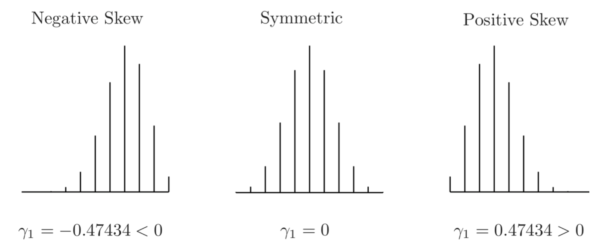
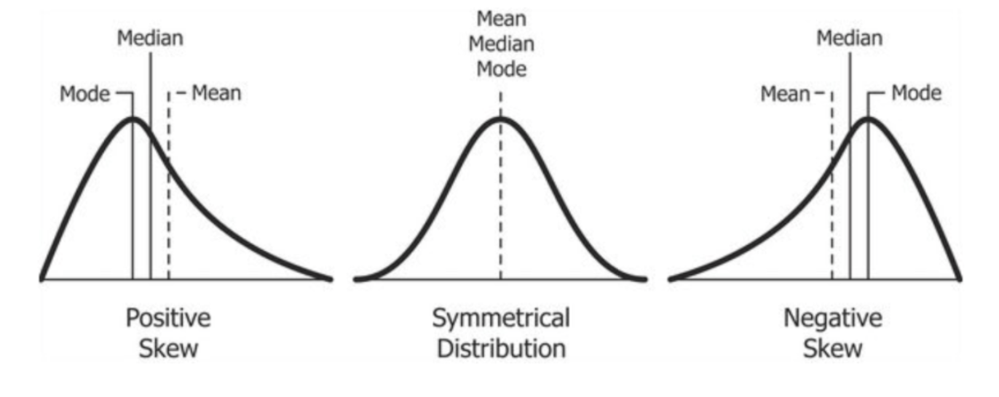
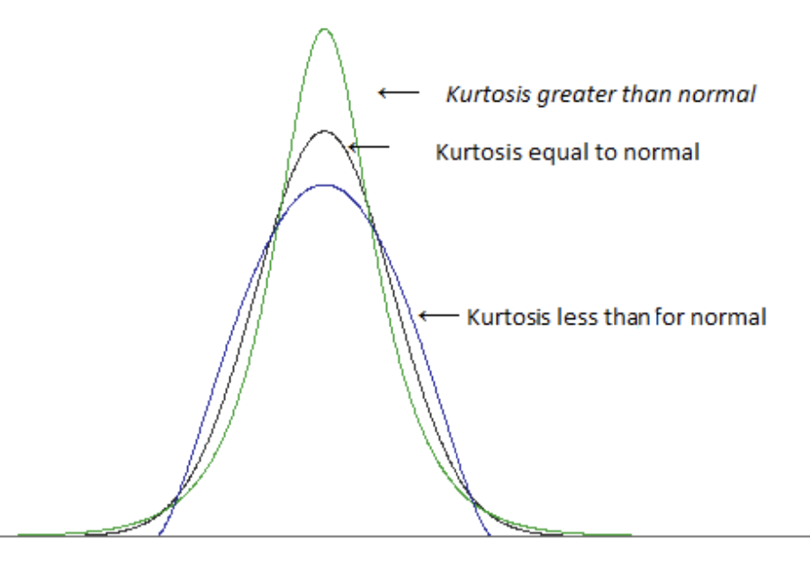

alias:: 正态分布, Normal Distribution, 常态分布, Gaussian distribution, 高斯分布
title:: normal distribution

- [[probability density function]] for [[normal distribution]]
	- $$
	  f(x)=\frac{1}{\sigma \sqrt{2 \pi}} e^{-\frac{1}{2}\left(\frac{x-\mu}{\sigma}\right)^{2}}
	  $$
		- $\mu$ is the mean or expectation of the distribution (also its median and mode)
		  $\sigma$ is the standard deviation
		  $\sigma^2$ is the variance of the distribution
- **How to identify normal distribution?**
	- ^^for normal distribution, skewness = 0, kurtosis = 3 (or excess kurtosis = 0)^^ excess kurtosis is the amount of kurtosis that excess 3
	- [[CheatSheet/R]] **Produce skewness and kurtosis**
	  collapsed:: true
		- ```r
		  library(e1071)
		  skewness(mpg) # 0.45 sightly right skewed
		  kurtosis(mpg) # negative excess kurtosis, shorter tails
		  ```
	- **Symmetry** (skewness)
	  collapsed:: true
		- skewness for [[normal random variable]] (population skewness)
			- $$
			  \mathrm{E}\left[\left(\frac{X-\mu}{\sigma}\right)^{3}\right]
			  $$
		- skewness for data set (**sample skewness**)
			- $$
			  \frac{\frac{1}{n} \sum_{i=1}^{n}\left(x_{i}-\bar{x}\right)^{3}}{\left[\frac{1}{n-1} \sum_{i=1}^{n}\left(x_{i}-\bar{x}\right)^{2}\right]^{3 / 2}}
			  $$
			- 
			- 
			-
	- Kurtosis (thickness of the tiles)
	  collapsed:: true
		- kurtosis for [[normal random variable]] (**population kurtosis**)
			- $$
			  \mathrm{E}\left[\left(\frac{X-\mu}{\sigma}\right)^{4}\right]
			  $$
		- kurtosis for data set (**sample kurtosis**)
			- $$
			  \frac{\frac{1}{n} \sum_{i=1}^{n}\left(x_{i}-\bar{x}\right)^{4}}{\left[\frac{1}{n} \sum_{i=1}^{n}\left(x_{i}-\bar{x}\right)^{2}\right]^{2}}-3
			  $$
			- 
	- **Quantile-quantile plot** ([[qqplot]])