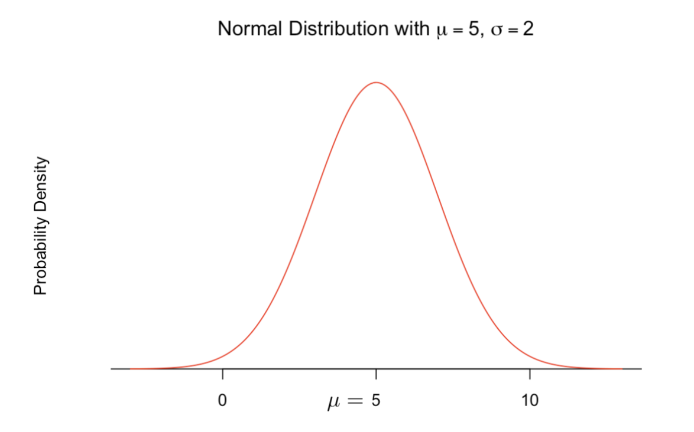
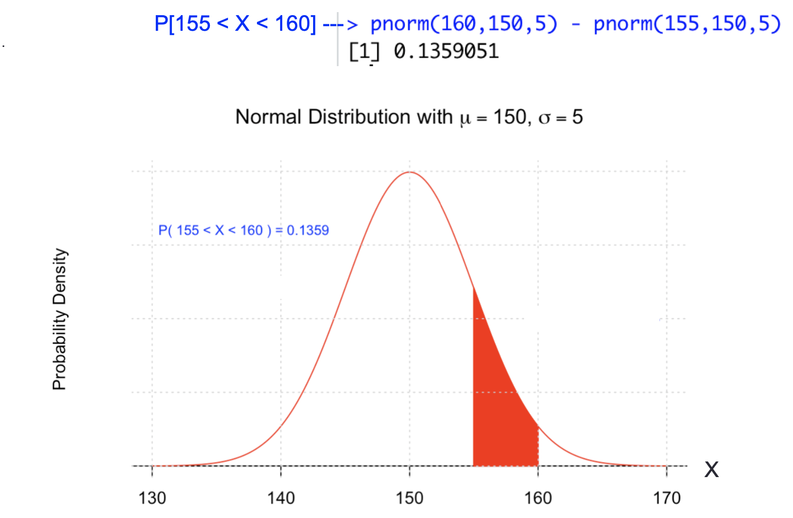

alias:: 正态随机变量

- # Definition
	- 符合[[normal distribution]]的随机变量
	- [[probability distribution function]] for normal random variable
	  id:: 61ee3c42-f8c0-49b4-b62d-ae0f0e475e82
		- $$
		  f(x)=\frac{1}{\sqrt{2 \pi}} e^{-\frac{1}{2}\left[\frac{x-\mu}{\sigma}\right]^{2}} \quad-\infty<x<\infty
		  $$
		- where $$X$$ is a normal random variable, with mean $$\mu$$ and variance $$\sigma^2$$
			- 
	- # Example
		- During 2020 the GRE verbal scores in the US are normal with a **mean of 150** and **standard deviation 5**, what is the probability that a new student score fails in the range 155 to 160
		- 
	-
-