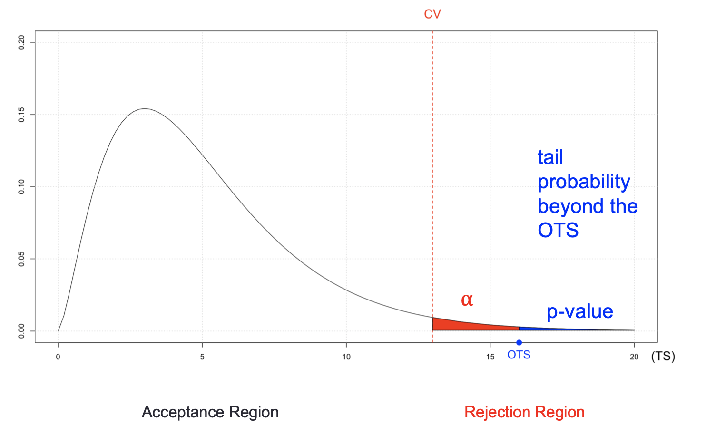

alias:: p值, p value, pvalue

- Definition
	- p-value is the tail probability of obtaining results as extreme as the observed results (when $H_0$ is true), ==是tail probability beyond the== [[OTS]]
		- {:height 265, :width 410}
	- 在零假设为真时所得到的样本观察结果或获得更极端结果的概率, p值是当原假设为真时，错误拒绝原假设的实际概率
		- 左尾检验的P值为检验统计量x小于样本统计值C的概率, 即: p = P( x < C)
		  右尾检验的P值为检验统计量x大于样本统计值C的概率, 即: p = P( x > C)
		  双尾检验的P值为检验统计量x落在样本统计值C为端点的尾部区域内的概率的2倍, 
		  即: p = 2P( x > C) (当C位于分布曲线的右端时) 
		  或p = 2P( X< C) (当C 位于分布曲线的左端时)
- Formula
	- ==p-value越小越好==
	  $$
	  p \text {-value }=\text { Probability } \mathrm{P}[\mathrm{TS}>\text { OTS } \mid H_0 \text { true }]
	  $$
-