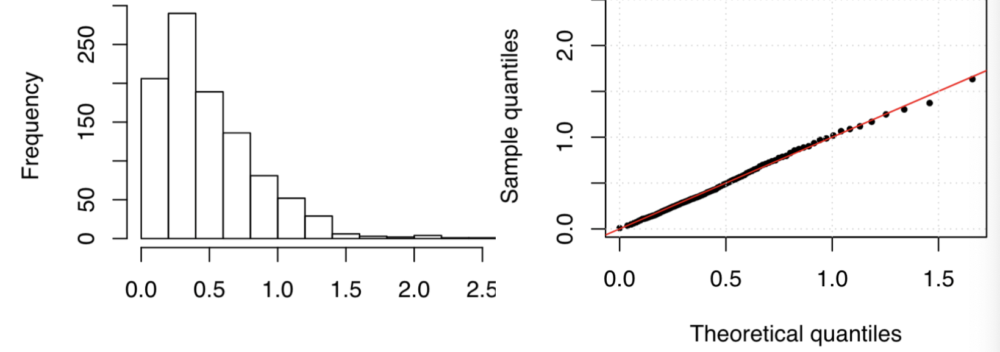
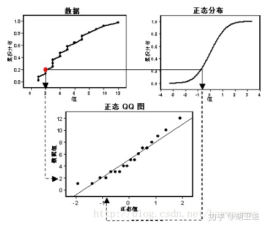
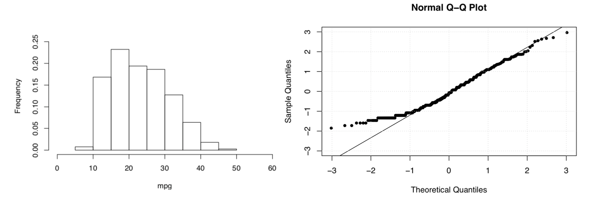

alias:: Quantile-Quantile plot, quantile-quantile plot, Q-Q图, 分位图, qq图

- [[CheatSheet/R]] qqplot
	- **qqplot**
		- ```r
		  # qq norm plot
		  qqnorm(x, pch=19, cex=0.7, ylim=c(-3,3))
		  qqline(x)
		  grid()
		  ```
		- ```r
		  # qq exp plot
		  set.seed(1)
		  n = 1000
		  x = rexp(n, rate = 2) #population rate, 生成的真实数据
		  a = seq(0, 1, 0.1)
		  plot(qexp(a, rate=1/mean(x)), quantile(x,a) #因为不知道真的population rate, 所以用公式估计, rate=1/mean(x) 期望的倒数
		       pch = 19, cex = 0.7, ylim=c(-3,3),
		       ylab = 'sample quantiles')
		  abline(0,1,lty=2,col='col',lwd=2)
		  grid()
		  ```
		- ```r
		  # qq gamma plot
		  set.seed(1)
		  n = 1000
		  x = rgamma(n, shape=2, rate=4)
		  a = seq(0,1,0.1)
		  plot(qgamma(a, shape=2, rate=4), quantile(x,a),
		       pch=19, cex=0.5, ylab="sample quantiles",
		       xlab="Theoretical quantiles")
		  abline(0.1, lty=1, col="red", lwd=1)
		  ```
			- 
- # Definition
	- qq图是一种散点图, 横坐标为某一样本的分位数, 纵坐标为另一个样本的分位数, 横坐标和纵坐标组成的散点图表示同意累计概率所对应的分位图. 若散点图在直线y=x附近分布, 则这两个样本是同等分布, 若横坐标样本为标准正态分布并且散点图在直线y=x附近分布，则纵坐标样本符合正态分布，并且直线斜率代表样本标准差，截距代表样本均值
	- 
	- 
- **Plot sample vs theoretical quantiles**
	- ```r
	  # sample quantile
	  x = scale(d2$mpg)
	  quantile(x, 0.1)
	  
	  # theoretical quantile
	  qnorm(0.1)
	  ```