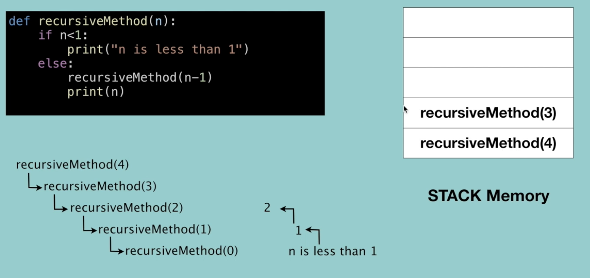
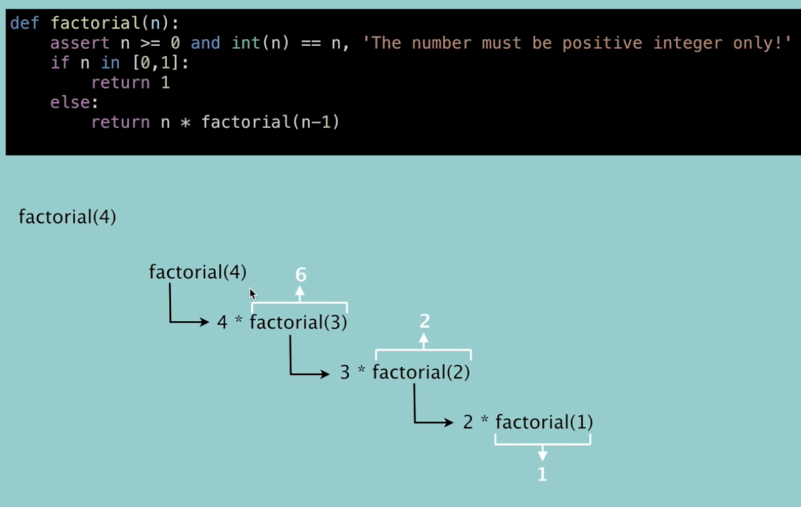
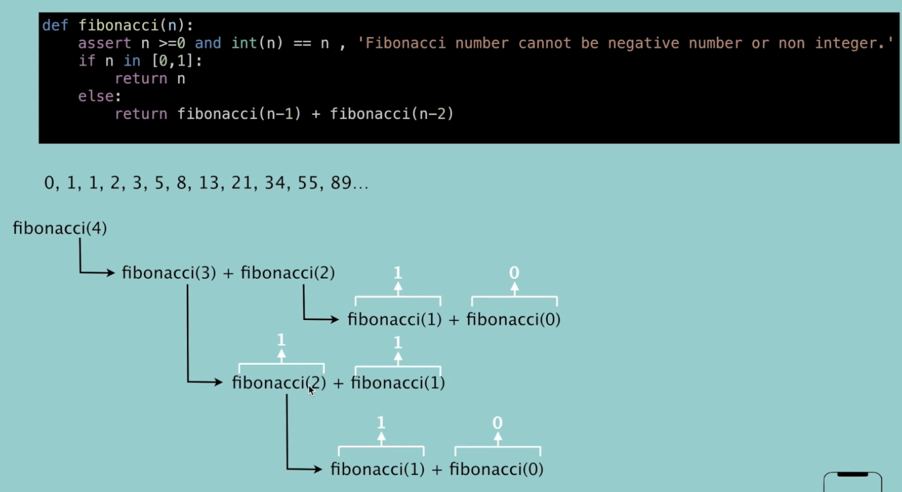

alias:: 递归

- Definition
	- A way of solving a problem by having ==a function calling itself==
	- Performing the ==same operation multiple times== with different inputs
	- Every step use smaller inputs to make the problem smaller
	- Base condition is needed to stop the recursion to avoid infinite loop
	- every problem can be solved using recursion can be solved using iteration
- Basic syntax of recursion
  collapsed:: true
	- ```python
	  def recursionMethod(parameters):
	    if exit from condition satisfied:
	      return some value
	    else:
	      recuesionMethod(modified parameters)
	  ```
	- how this works
	  collapsed:: true
		- 
		- every time the method is called, the system stores it in the stack for coming back, because there are execution statements left after calling itself
		- stack memory: 自下往上储存, 自上往下输出 
		  (LIFO: last in first out)
	- Example
	  collapsed:: true
		- ```python
		  def powerOfTwo(n):
		    if n == 0:
		      return 1
		    else:
		      power = powerOfTwo(n-1)
		      return power*2
		  
		  powerOfTwo(3)
		  ```
		- 原理
			- 进入stack:
			        powerOfTwo(0) <- forth in
			      powerOfTwo(1) <- third in
			    powerOfTwo(2) <- second in
			  powerOfTwo(3) <- first in
			- 出 stack:
			  powerOfTwo(0) -> first out: power = 1
			  powerOfTwo(1) -> second out: update power = 1\*2
			  powerOfTwo(2) -> third out: update power = 1\*2\*2
			  powerOfTwo(3) -> forth out: update power = 1\*2\*2\*2
- Three steps to write recursion
	- factorial as example
		- recursive case - the flow
		  collapsed:: true
			- the function is$n! = n * (n-1) * (n-2) * ... * 2 * 1$
			  where $(n-1) * (n-2) * ... * 2 * 1 = (n-1)!$
			  so $n! = n*(n-1)!$
			- ```python
			  def factorial(n):
			    return n * factorial(n-1)
			  ```
		- Base case - the stopping criterion
		  collapsed:: true
			- ```python
			  def factorial(n):
			    if n in [0,1]:
			      return 1
			    else:
			      return n*factorial(n-1)
			  ```
		- Unintentional case - the constraint
		  collapsed:: true
			- if put n = -1, the recursion wont stop
			- ```python
			  def factorial(n):
			    assert n >= 0 and int(n) == n, "the number must be possitive integer only"
			    if n in [0,1]:
			      return 1
			    else:
			      return n*factorial(n-1)
			  ```
				- 原理
					- 
	- Fibonacci as example
		- recursive case - the flow
		  collapsed:: true
			- 0, 1, 1, 2, 3, 5, 8,...
			- $f(n) = f(n-1) + f(n-2)$
			- ```python
			  def fibonacci(n):
			    return fibonacci(n-1) + fibonacci(n-2)
			  ```
		- Base case - the stopping criterion
		  collapsed:: true
			- if n = 1 or 0 will return itself
			- ```python
			  def fibonacci(n):
			      if n in [1,0]:
			          return n
			      else:
			          return fibonacci(n-1) + fibonacci(n-2)
			  ```
		- Unintentional case - the constraint
		  collapsed:: true
			- n >= 0, int(n)
			- ```python
			  def fibonacci(n):
			      assert n >=0 and int(n) == n , 'Fibonacci number cannot be negative number or non integer.'
			      if n in [0,1]:
			          return n
			      else:
			          return fibonacci(n-1) + fibonacci(n-2)
			  ```
				- 原理
				  collapsed:: true
					- 
- Note
	- trees, graphs, divide and conquer, greedy, dynamic programming ==> recursion a lot
	- condition often not using recursion
		- design an algorithm to compute nth...
		- Write an algorithm to compute nth...
		- Write code to list the n...
		- Implement a method to compute all...