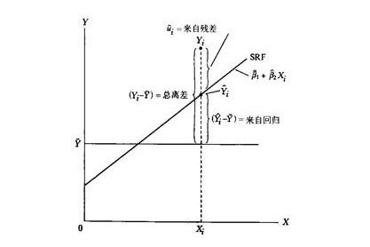

Alias:: RSS, 残差平方和, SSR

- # Definition
	- 由误差导致的真实值和估计值之间的偏差平方和
	- For [[simple linear regression]]
		- $$
		  \mathrm{RSS}=e_{1}^{2}+e_{2}^{2}+\cdots+e_{n}^{2}
		  $$
		  $$
		  \mathrm{RSS}=\left(y_{1}-\hat{\beta}_{0}-\hat{\beta}_{1} x_{1}\right)^{2}+\left(y_{2}-\hat{\beta}_{0}-\hat{\beta}_{1} x_{2}\right)^{2}+\cdots+\left(y_{n}-\hat{\beta}_{0}-\hat{\beta}_{1} x_{n}\right)^{2}
		  $$
		- RSS 公式
			- $$
			  R S S=\sum_{i=1}^{n}\left(y_{i}-\hat{y}_{i}\right)^{2}
			  $$
		- use [[least square method]]
			- id:: 61f23283-4ccc-4166-b211-3e429f6f0db9
			  $$\begin{aligned}
			  &\hat{\beta}_{1}=\frac{\sum_{i=1}^{n}\left(x_{i}-\bar{x}\right)\left(y_{i}-\bar{y}\right)}{\sum_{i=1}^{n}\left(x_{i}-\bar{x}\right)^{2}} \\
			  &\hat{\beta}_{0}=\bar{y}-\hat{\beta}_{1} \bar{x}
			  \end{aligned}$$
				- $\hat{\beta_0}$ and $\hat{\beta_1}$ are linear combinations of observations $y_i$ (i = 1, ..., n)
				- $E(\hat{\beta_0}) = \beta_0$, $E(\hat{\beta_1}) = \beta_1$ 期望值等于真实值
		- #+BEGIN_NOTE
		  [[TSS]] = [[ESS]] + [[RSS]]
		  #+END_NOTE
			- $$
			  \begin{gathered}
			  T S S=\sum\left(y_{i}-\bar{y}\right)^{2} \\
			  E S S=\sum\left(\hat{y}_{i}-\bar{y}\right)^{2} \\
			  R S S=\sum\left(y_{i}-\hat{y}_{i}\right)^{2}=\sum e_{i}^{2} \\
			  \text { Since }\left(y_{i}-\bar{y}\right)=\left(y_{i}-\hat{y}_{i}+\hat{y}_{i}-\bar{y}\right) \\
			  \text { Then } \sum\left(y_{i}-\bar{y}\right)^{2}=\sum\left(y_{i}-\hat{y}_{i}+\hat{y}_{i}-\bar{y}\right)^{2}=\sum e_{i}^{2}+\sum \hat{y}_{i}-\bar{y}^{2}+2 \sum e_{i}\left(\hat{y}_{i}-\bar{y}\right) \\
			  \text { Since } \sum e_{i}\left(\hat{y}_{i}-\bar{y}\right)=\sum e_{i} \hat{y}_{i}-\bar{y} \sum e_{i}=o \\
			  \text { then } \sum\left(y_{i}-\bar{y}\right)^{2}=\sum e_{i}^{2}+\sum\left(\hat{y}_{i}-\bar{y}\right)^{2}
			  \end{gathered}
			  $$
			- 
				- 样本回归函数SRF
	- For [[multiple linear regression]]
		- id:: 62048e84-073b-4035-99fc-a8a7667c36a4
		  $$
		  \begin{aligned}
		  \mathrm{RSS} &=\sum_{i=1}^{n}\left(y_{i}-\hat{y}_{i}\right)^{2} \\
		  &=\sum_{i=1}^{n}\left(y_{i}-\hat{\beta}_{0}-\hat{\beta}_{1} x_{i 1}-\hat{\beta}_{2} x_{i 2}-\cdots-\hat{\beta}_{p} x_{i p}\right)^{2}
		  \end{aligned}
		  $$
		-
- Note
	- RSS 和 [[r2]] 一样, 都会随着更多变量的纳入使得训练误差降低