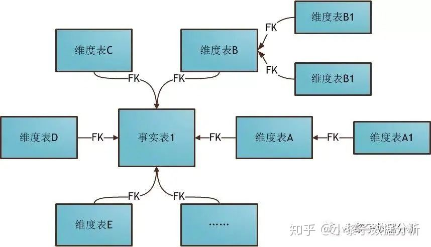

alias:: 雪花型模型, 雪花模型

- Definition
	- 有一个或多个[[维度表]] 没有直接链接到 [[事实表]]上, 而是通过其他维度表链接到事实表上, 对 [[雪花模型]]的拓展, 原有的各个维表可能被拓展成小的事实表, 形成局部的层次区域
- Example
	- 
- Pros and cons
	- Saving in storage space
	- Normalized structures are easier to update and maintain
	- 不产生冗余数据 (就是重复的数据)
	- ---
	- Schema less intuitive
	- Degraded query performance due to additional joins required