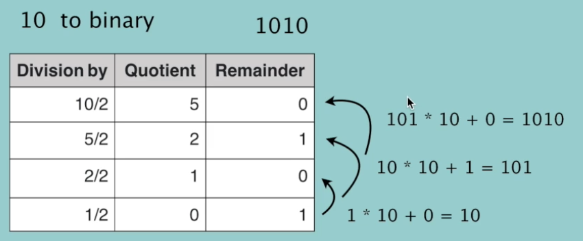
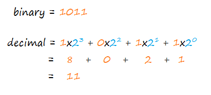

alias:: binary

- 十进制转二进制
	- `f(n) = n%2 + 10*f(n//2)`
	- `bin()`
	- Example
		- Step 1 Divide the number by 2
		  Step 2 Get the integer quotient for the next iteration
		  Step 3 Get the remainder for the binary digit
		  Step 3 Repeat the steps until the quotient is equal to 0
		- 13 to binary (1101)
		  |Division by|Quotient|Remainder|
		  |13/2|6|1|
		  |6/2|3|0|
		  |3/2|1|1|
		  |1/2|0|1|
		- 
		- ```python
		  def toBinary(num):
		      if num == 0:
		          return 0
		      return num%2 + 10*toBinary(num//2)
		  
		  toBinary(13) # => 1101
		  ```
- 二进制转十进制
	- `int(res,2)`
	- Example
		- 
		- ```python
		  def toBase10(num):
		      l = len(num)-1
		      if l == 0 and int(num) == 1:
		          return 1
		      if l == 0 and int(num) == 0:
		          return 0
		      return int(num[0])*pow(2,l) + toBase10(num[1:])
		  toBase10('1101')
		  ```