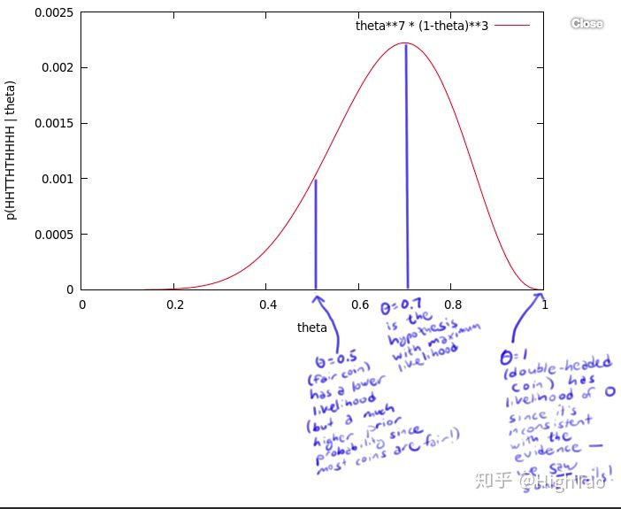

alias:: likehood, 似然, likehood function, likelihood, likelihood function

- Formula
	- 给定联合样本值 $x$ 下关于(未知) 参数 $\theta$ 的函数
		- $$
		  L(\theta \mid \mathbf{x})=f(\mathbf{x} \mid \theta)
		  $$
		- $x$ 是联合样本随机变量 $X$ 取到的值, $X=x$
		  $\theta$ 未知参数, 属于参数空间
		  $f(x|\theta)$ 是 [[密度函数]], 表示给定 $\theta$ 下关于联合样本值 $x$ 的联合密度函数
- Difference between [[似然函数]] and [[密度函数]]
	- 从定义上, 似然函数和密度函数是完全不同的两个数学对象: 
	  似然函数是关于$\theta$的函数,
	  密度函数是关于$x$的函数. 
	  所以这里的等号理解为==函数值形式的相等==, 而不是两个函数本身是同一函数(根据函数相等的定义, 函数相等当且仅当定义域相等并且对应关系相等)
	- 概率(密度)表达给定$\theta$下样本随机向量$X= x$的可能性
	  似然表达了给定样本$X = x$下参数$\theta_1$(相对于另外的参数$\theta_2$)为真实值的可能性
	  因为参数是一个实数而非随机变量, 所以我们一般不谈一个参数的概率, 所以叫似然
- Definition
	- 通俗解释
		- $p(x|θ)$ 是一个有着两个变量的函数. 
		  如果将$θ$设为常量, 会得到一个概率函数 (关于$x$的函数)
		  如果将$x$设为常量, 将得到似然函数 (关于$θ$的函数)
- [[assumption]]
	- 独立同分布
- Example
  id:: 621c4dfb-5f6f-4cae-873c-0b8722cd91aa
	- 一个硬币, 有$\theta$ 的概率会正面朝上 (H), $1-\theta$ 的概率反面朝上(T), $\theta$ 是存在的, 但是我们不知道, 为了获得$\theta$ 的值, 做实验将硬币抛10次, 得到一个概率值
	  $$
	  \mathrm{x}=\mathrm{HHTTHTHHHH}
	  $$
	- 无论 $\theta$ 的值是多少, 这个序列的概率值为 
	  $$
	  \theta \cdot \theta \cdot(1-\theta) \cdot(1-\theta) \cdot \theta \cdot(1-\theta) \cdot \theta \cdot \theta \cdot \theta \cdot \theta=\theta^{7}(1-\theta)^{3}
	  $$
	- 尝试所有$\theta$ 可取的值, 得到 $\theta$ 的似然函数, 其中0.7为极大似然估计的取值, 如果多次实验, 扩充样本空间, 最后的最大结果接近0.5
		- 
	-