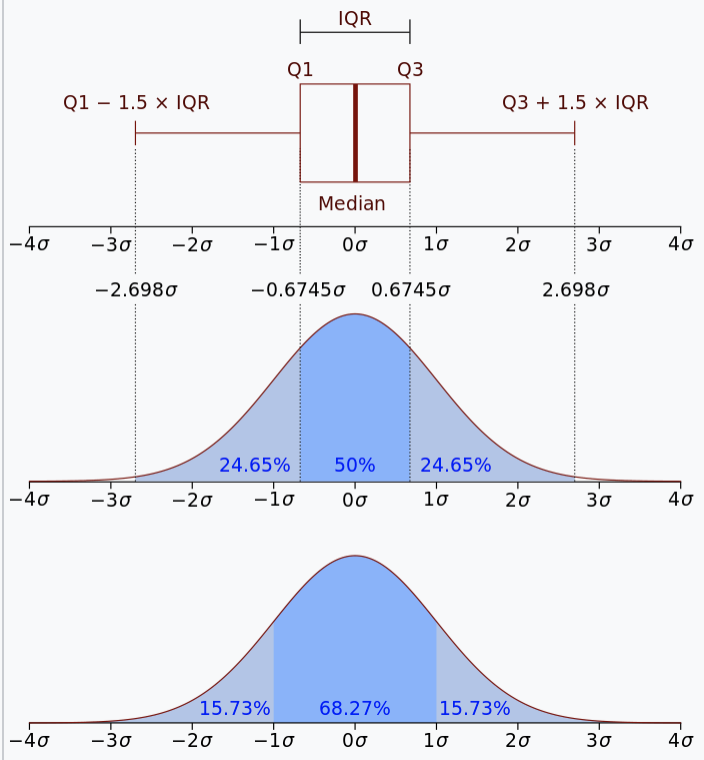

alias:: probability density function, PDF, 密度函数, density function

- Definition
	- 是一个描述这个随机变量的输出值, 在某个确定的取值点附近的可能性的函数. 
	  横轴为随机变量的取值，纵轴为概率密度函数的值, 而随机变量的取值落在某个区域内的概率为概率密度函数在这个区域上的积分. 
	  当概率密度函数存在的时候, [[累积分布函数]] 是概率密度函数的积分
		- 