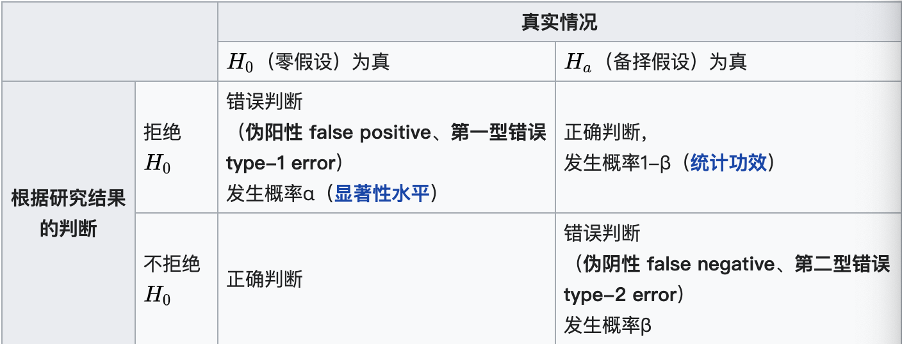

alias:: type 1 error, type 2 error, 第一型错误, 第二型错误, type 1 error & type 2 error, type I error, type II error
related:: [[ROC]], [[sensitivity]], [[specificity]]

- Definition
	- 若零假设事实上成立, 但统计检验的结果拒绝零假设(接受备择假设), 这种错误称为第一型错误(弃真)
	  若零假设事实上不成立, 但统计检验的结果不拒绝零假设, 这种错误称为第二型错误(存伪)
	- 以利用验孕棒验孕为例, 此时没有怀孕为零假设.
	  若用验孕棒替一位未怀孕者验孕, 结果呈已怀孕, 此即第一型错误. 
	  若用验孕棒替一位已怀孕者验孕, 结果呈未怀孕, 此即第二型错误.
	- 